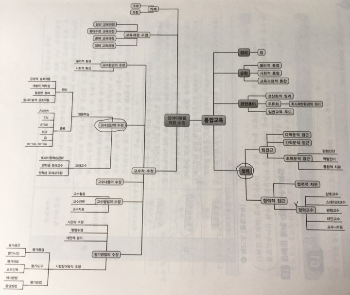

# 개괄

###### 유형
물리적 통합, 사회적 통합, 교육과정적 통합

###### 협력
1. 협력교수 : 일반교사 + 특수교사
  - 교수적수정
      - 환경 설정
      - 집단(학생들의 집단을 의미) - 협동학습, 또래교수
      - 내용 - 일반교육과정,
           - 중다수준C(다수준C - 5학년 학생에게 1학년 내용을)
           - 중복C (2개 이상의 교육과정을 일반교육과정, 기본교육과정 1개의 수업에 진행한다)
           - 대체C (아예 다른 교육과정)
      - 교수방법 자료,활동,전략 (구분이 어려워 겹치는건 교수방법 ex 자료를 다르게 준다, 표로 준다 등)
      - 평가방법수정* - 정통적인 평가 방식이 아닌 모든 것을 대안적인 평가방식이라고 한다
2. 팀(다양한 전문가 집단)
  - 다학문적 : 진단,목표설정,중재 (제각기 맡고 제작기 중재합니다)
  - 간학문적 : 언어치료를 국어수업에 섞어보는... (진단,중재는 따로하지만 목표는 같이 합니다)
  - 초학문적
    - 역할전이 : 중재는 주서비스 제공자가 같이 제공
    - 원형진단 : 문제점을 같이 봅니다 (진단을 같이 합니다 ,영역을 초월합니다)


```
# 일반학급- 집단 수업
# 특수교육대상자는 일반교육과정이 어려움
일반교육과정 - 보편적 학습설계 + 교수적 수정(= 교수적합화) + 보조공학
            - 긍정적행동지원, IEP , 진단 및 평가

# 모든 특수교육대상자들의 특성이 다양하기에 정해진 방식으로는 가르칠 수 없다.
특수교육 - 특수교육대상자 선정 - 교육제공- IEP - 평가

다학문적, 간학문적에서 진단을 따로하면 위험하다... ( 의사 vs 체육선생님 )

교육과정을 운영한다 - 아동의 특성에 맞게 난이도를 조정하는 등 조절한다.

'협력교수' 의 유형
(모둠을 나누냐, 모둠을 나눈다면 어떤 기준으로 나누느냐, 특수교사의 역할은 무엇인가)
무엇을 바꾸어느냐에 따라 5개의 유형으로 나누어진다
교수적수정
      - 환경 설정
      - 집단(학생들의 집단을 의미) - 협동학습, 또래교수
      - 내용 - 일반교육과정,
             - 중다수준C(다수준C - 5학년 학생에게 1학년 내용을)
             - 중복C (2개 이상의 교육과정을 일반교육과정, 기본교육과정 1개의 수업에 진행한다)
             - 대체C (아예 다른 교육과정)
      - 교수방법 자료,활동,전략 (구분이 어려워 겹치는건 교수방법 ex 자료를 다르게 준다, 표로 준다 등)
      - 평가방법수정* - 정통적인 평가 방식이 아닌 모든 것을 대안적인 평가방식이라고 한다
```


